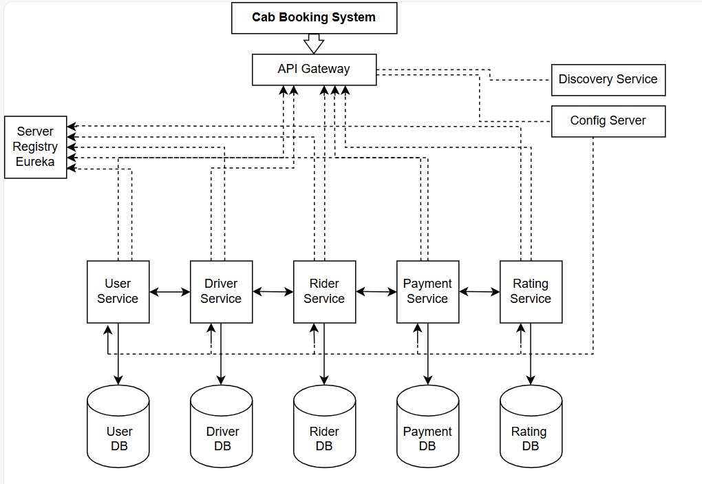

# Project Overview

## Table of Contents
- [Project Introduction](#project-introduction)
- [Architecture Diagram](#architecture-diagram)
- [Technologies Used](#technologies-used)
    - [Backend](#backend)
    - [Frontend](#frontend)
    - [Other Tools and Libraries](#other-tools-and-libraries)
- [Backend Dependencies](#backend-dependencies)
- [Module Documentation](#module-documentation)
    - [User Module](./User_Module.md)
    - [Driver Module](./Driver_Module.md)
    - [Ride Module](./Ride_Module.md)
    - [Payment Module](./Payment_Module.md)
    - [Rating Module](./Rating_Module.md)
- [How to Run This Project with Eureka and API Gateway](#how-to-run-this-project-with-eureka-and-api-gateway)
- [Project Contributors](#project-contributors)


## Project Introduction
* The Cab Booking System is a comprehensive application designed to simplify the process of booking rides, managing drivers, processing payments, and collecting feedback. 
* It provides a seamless experience for users and drivers, ensuring efficient ride management and payment processing. 
* The system is built with modular components to handle user management, driver management, ride booking, payment processing, and rating/feedback functionalities. 
* Each module is designed to interact cohesively, delivering a robust and scalable solution for cab booking services.

## Architecture Diagram


## Technologies Used

### Backend
- **Framework**: Spring Boot  
- **Database**: MySQL  
- **Authentication**: JWT (JSON Web Tokens)  
- **ORM**: Hibernate (via Spring Data JPA)  
- **Security**: Spring Security  
- **Build Tool**: Maven  

### Frontend
- **Framework**: React.js  
- **Styling**: CSS/Bootstrap  

### Other Tools and Libraries
- **Logging**: SLF4J and Logback  
- **Dependency Management**: Lombok  
- **API Documentation**: Swagger/OpenAPI  
- **Testing**: JUnit and Mockito  

## Backend Dependencies
- **Spring Boot Starter Web**: For building RESTful APIs.  
- **Spring Boot Starter Security**: For implementing authentication and authorization.  
- **Spring Boot Starter Data JPA**: For ORM and database interactions using Hibernate.  
- **Spring Boot Starter Validation**: For validating request payloads.  
- **Spring Boot Starter Test**: For testing with JUnit and Mockito.  
- **Spring Boot Starter Logging**: For logging with SLF4J and Logback.  
- **Lombok**: For reducing boilerplate code (e.g., getters, setters, constructors).  
- **JWT Utilities**: For generating and validating JSON Web Tokens.  
- **MySQL Connector**: For connecting to the MySQL database.  
- **Swagger/OpenAPI**: For API documentation and testing.  

## Module Documentation
- [User Module](./User_Module.md)  
  ### Handles user registration, login, and profile management

- [Driver Module](./Driver_Module.md)
  ### Manages driver profiles, vehicle details, and availability status  

- [Ride Module](./Ride_Module.md)
  ### Booking Facilitates cab booking, ride status management, and driver assignment

- [Payment Module](./Payment_Module.md)  
  ### Supports fare calculation, payment processing, and receipt generation

- [Rating Module](./Rating_Module.md)  
  ### Allows users and drivers to rate and review each other post-ride.

## How to Run This Project with Eureka and API Gateway

### Prerequisites
- Java 21  
- Maven  
- MySQL running and configured in `application.properties`  
- Eureka Server (Spring Cloud Netflix Eureka)  
- API Gateway (Spring Cloud Gateway)  
- Spring Cloud Config Server  

### Steps to Run
1. **Start Config Server**  
     - Clone or create a Spring Cloud Config Server project.  
     - Run the Config Server:  
         ```bash
         cd config-server
         mvn spring-boot:run
         ```

2. **Start Eureka Server**  
     - Clone or create a Eureka Server Spring Boot project.  
     - Run the Eureka Server:  
         ```bash
         cd eureka-server
         mvn spring-boot:run
         ```

3. **Start API Gateway Server**  
     - Clone or create an API Gateway Spring Boot project.  
     - Run the API Gateway:  
         ```bash
         cd api-gateway-server
         mvn spring-boot:run
         ```

4. **Start User Service**  
     - Clone or create the User Service Spring Boot project.  
     - Run the User Service:  
         ```bash
         cd user-service
         mvn spring-boot:run
         ```

5. **Start Driver Service**  
     - Clone or create the Driver Service Spring Boot project.  
     - Run the Driver Service:  
         ```bash
         cd driver-service
         mvn spring-boot:run
         ```

6. **Start Ride Service**  
     - Clone or create the Ride Service Spring Boot project.  
     - Run the Ride Service:  
         ```bash
         cd ride-service
         mvn spring-boot:run
         ```

7. **Start Payment Service**  
     - Clone or create the Payment Service Spring Boot project.  
     - Run the Payment Service:  
         ```bash
         cd payment-service
         mvn spring-boot:run
         ```

8. **Start Feedback Service**  
     - Clone or create the Feedback Service Spring Boot project.  
     - Run the Feedback Service:  
         ```bash
         cd feedback-service
         mvn spring-boot:run
         ```

Once all the services are running, you can access the application through the API Gateway. Ensure that all services are registered with the Eureka Server and are properly configured in the Config Server.


# Project Contributors

- Srujan G S
- Manjiri Gulalkari
- Uddhav Shelke
- Spandhitha I S