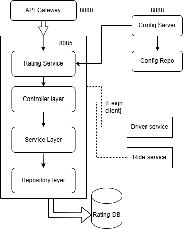

# Rating Module 

## Table of Contents
- [Module Overview](#module-overview)
- [Key Features](#key-features)
- [Table Design](#table-design)
    - [Rating Table](#rating-table)
- [Component Diagram](#component-diagram)
- [Layered Architecture of Rating Module](#layered-architecture-of-rating-module)
    - [Controller Layer](#controller-layer)
    - [Service Layer](#service-layer)
    - [Repository/Data Access Layer](#repositorydata-access-layer)
- [API Endpoints](#api-endpoints)

---

## Module Overview 
The **Rating Module** manages rating and feedback functionalities within the Cab Booking System. It enables users to rate drivers after rides and allows drivers to access their ratings. This module promotes transparency and service quality improvement.

---

## Key Features
- **Submit Rating**: Users can rate drivers and provide optional feedback after rides.
- **Retrieve Ratings**: Drivers can view their ratings and user feedback.

---

## Table Design

### Rating Table
| Column Name       | Data Type         | Constraints                  | Description                                 |
|-------------------|-------------------|------------------------------|---------------------------------------------|
| **ratingId**      | BIGINT            | Primary Key, Auto Increment  | Unique identifier for the rating            |
| **rideId**        | BIGINT            | Foreign Key                  | Reference to the ride associated with the rating |
| **fromUserId**    | BIGINT            | Foreign Key                  | Reference to the user providing the rating  |
| **toUserId**      | BIGINT            | Foreign Key                  | Reference to the driver receiving the rating|
| **score**         | INT               | Not Null                     | Rating score (e.g., 1 to 5)                 |
| **comments**      | VARCHAR(255)      | Optional                     | Feedback comments                           |

---

# Component Diagram



    subgraph Entity Layer
        Rating["Rating"]
    end

    subgraph DTO Layer
        RatingRequest["RatingRequest"]
    end

    RatingController --> RatingServiceImpl
    RatingServiceImpl --> RatingService
    RatingServiceImpl --> RatingRepository
    RatingRepository --> Rating
    RatingController --> RatingRequest
```

---

## Layered Architecture of Rating Module

The **Rating Module** follows a classic 3-layered architecture:

### Controller Layer
- **Purpose**: Handles HTTP requests and maps them to service methods.
- **Component**: `RatingController`
- **Endpoints**:
    - `POST /api/ratings`: Handles submission of ratings and feedback.
    - `GET /api/ratings/user/{userId}`: Retrieves ratings for a specific user or driver.

### Service Layer
- **Purpose**: Contains the business logic for rating-related operations.
- **Components**:
    - `RatingServiceImpl`: Implements the business logic for submitting ratings and retrieving ratings.
    - `RatingService`: Interface defining the contract for rating-related services.

### Repository/Data Access Layer
- **Purpose**: Interacts with the database to perform CRUD operations on the Rating entity.
- **Component**: `RatingRepository`
- **Methods**:
    - `findByToUserId(Long toUserId)`: Retrieves ratings for a specific driver.

---

## API Endpoints

| **Method** | **Endpoint**                  | **Description**                          |
|------------|-------------------------------|------------------------------------------|
| `POST`     | `/api/ratings`               | Submit a new rating and feedback         |
| `GET`      | `/api/ratings/user/{userId}` | Retrieve ratings for a specific user/driver |
```	