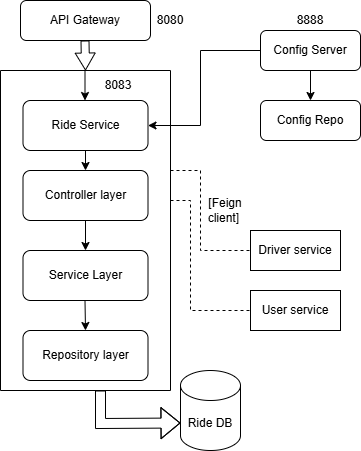

# Ride Module

## Table of Contents
- [Module Overview](#module-overview)
- [Key Features](#key-features)
- [Table Design](#table-design)
    - [Ride Table](#ride-table)
- [Component Diagram](#component-diagram)
- [Layered Architecture of Ride Module](#layered-architecture-of-ride-module)
    - [Controller Layer](#controller-layer)
    - [Service Layer](#service-layer)
    - [Repository/Data Access Layer](#repositorydata-access-layer)
- [API Endpoints](#api-endpoints)

---

## Module Overview

The **Ride Module** manages ride-related functionalities within the Cab Booking System. It includes operations such as booking rides, updating ride statuses, and retrieving ride history for users. This module ensures smooth interaction between users and drivers for efficient ride management.

---

## Key Features
- **Ride Booking**: Allows users to book rides by specifying pickup and dropoff locations.
- **Ride Status Update**: Enables drivers to update the status of rides (e.g., REQUESTED, IN_PROGRESS, COMPLETED).
- **Ride History Retrieval**: Provides users with a list of their past rides.

---

## Table Design

### Ride Table
| Column Name        | Data Type         | Constraints                  | Description                                 |
|--------------------|-------------------|------------------------------|---------------------------------------------|
| **rideId**         | BIGINT            | Primary Key, Auto Increment  | Unique identifier for the ride              |
| **userId**         | BIGINT            | Foreign Key                  | Reference to the user who booked the ride   |
| **driverId**       | BIGINT            | Foreign Key                  | Reference to the driver assigned to the ride|
| **pickupLocation** | VARCHAR(255)      | Not Null                     | Pickup location for the ride                |
| **dropoffLocation**| VARCHAR(255)      | Not Null                     | Dropoff location for the ride               |
| **fare**           | DOUBLE            | Not Null                     | Fare for the ride                           |
| **status**         | ENUM              | Not Null                     | Status of the ride (e.g., REQUESTED, IN_PROGRESS, COMPLETED) |

---

## Component Diagram


    
```

## Layered Architecture of Ride Module

The Ride Module follows a classic 3-layered architecture:

### Controller Layer
- **Purpose**: Handles HTTP requests and maps them to service methods.
- **Component**: `RideController`
- **Endpoints**:
    - `POST /api/rides/book`: Handles ride booking.
    - `PUT /api/rides/status/{id}`: Updates the status of a ride.
    - `GET /api/rides/user/{userId}`: Retrieves ride history for a user.

### Service Layer
- **Purpose**: Contains the business logic for ride-related operations.
- **Components**:
    - `RideServiceImpl`: Implements the business logic for ride booking, status updates, and ride retrieval.
    - `RideService`: Interface defining the contract for ride-related services.

### Repository/Data Access Layer
- **Purpose**: Interacts with the database to perform CRUD operations on the Ride entity.
- **Component**: `RideRepository`
- **Methods**:
    - `findByUserUserId(Long userId)`: Retrieves rides for a specific user.
    - `findByDriverDriverId(Long driverId)`: Retrieves rides assigned to a specific driver.

---

## API Endpoints

| Method | Endpoint                      | Description                                 |
|--------|-------------------------------|---------------------------------------------|
| POST   | /api/rides/book               | Book a new ride                             |
| PUT    | /api/rides/status/{id}        | Update the status of a ride                 |
| GET    | /api/rides/user/{userId}      | Retrieve ride history for a specific user   |