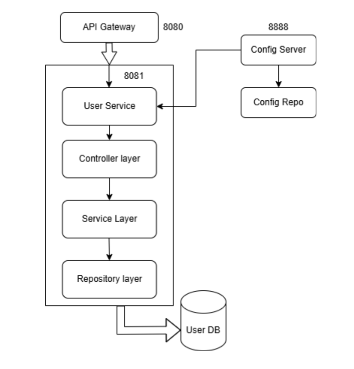

# User Module 
## Table of Contents
- [Module overview](#module-overview)
- [Key Features](#key-features)
- [Table Design](#table-design)
  - [User Table](#user-table)
- [Component Diagram](#component-diagram)
- [Layered Architecture of User Module](#layered-architecture-of-user-module)
  - [1. Controller Layer](#1-controller-layer)
  - [2. Service Layer](#2-service-layer)
  - [3. Repository/Data Access Layer](#3-repositorydata-access-layer)
- [API Endpoints](#api-endpoints)
  

## Module overview 
The **User Module** is responsible for managing user-related functionalities within the Cab Booking System. It handles operations such as user registration, login, profile retrieval, and logout. This module ensures secure authentication and authorization using JWT tokens and provides seamless interaction between the user and the system.

### Key Features:
- **User Registration**: Allows new users to register with their details.
- **User Login**: Authenticates users and generates JWT tokens for secure access.
- **Profile Management**: Retrieves user profile information based on authentication tokens.
- **Logout**: Handles user logout functionality.

The module is designed with a layered architecture, ensuring separation of concerns and scalability. It interacts with other modules such as Ride Booking and Payment Processing to provide a cohesive user experience.

# Table Design

## User Table
| Column Name     | Data Type         | Constraints                  | Description                     |
|-----------------|-------------------|------------------------------|---------------------------------|
| **userId**      | BIGINT            | Primary Key, Auto Increment  | Unique identifier for the user |
| **name**        | VARCHAR(255)      | Not Null                     | Name of the user               |
| **email**       | VARCHAR(255)      | Unique, Not Null             | Email address of the user      |
| **phone**       | VARCHAR(15)       | Unique, Not Null             | Phone number of the user       |
| **passwordHash**| VARCHAR(255)      | Not Null                     | Hashed password for security   |
| **role**        | ENUM              | Not Null                     | Role of the user (e.g., USER)  |
| **createdAt**   | TIMESTAMP         | Not Null                     | Timestamp of user creation     |

# Component Diagram

# Layered Architecture of User Module

The **User Module** follows a classic 3-layered architecture to ensure separation of concerns, scalability, and maintainability. The layers are:

## 1. Controller Layer
- **Purpose**: Handles HTTP requests and maps them to service methods.
- **Component**: `UserController`
  - Endpoints:
    - `POST /api/users/register`: Handles user registration.
    - `POST /api/users/login`: Handles user login and JWT generation.
    - `GET /api/users/profile`: Retrieves user profile information.

---

## 2. Service Layer
- **Purpose**: Contains the business logic for user-related operations.
- **Components**:
  - `UserServiceImpl`: Implements the business logic for user registration, login, and profile retrieval.
  - `UserService`: Interface defining the contract for user-related services.

---

## 3. Repository/Data Access Layer
- **Purpose**: Interacts with the database to perform CRUD operations on the `User` entity.
- **Component**: `UserRepository`
  - Methods:
    - `findByEmail(String email)`: Retrieves a user by email.
    - `findByPhone(String phone)`: Retrieves a user by phone.

---
# API Endpoints

| HTTP Method | Endpoint                | Description                        | Request Body / Params         |
|-------------|------------------------|------------------------------------|------------------------------|
| POST        | /api/users/register    | Register a new user                | UserRegisterRequest (JSON)    |
| POST        | /api/users/login       | Authenticate user and get JWT      | UserLoginRequest (JSON)       |
| GET         | /api/users/profile     | Get authenticated user's profile   | JWT in Authorization header   |

